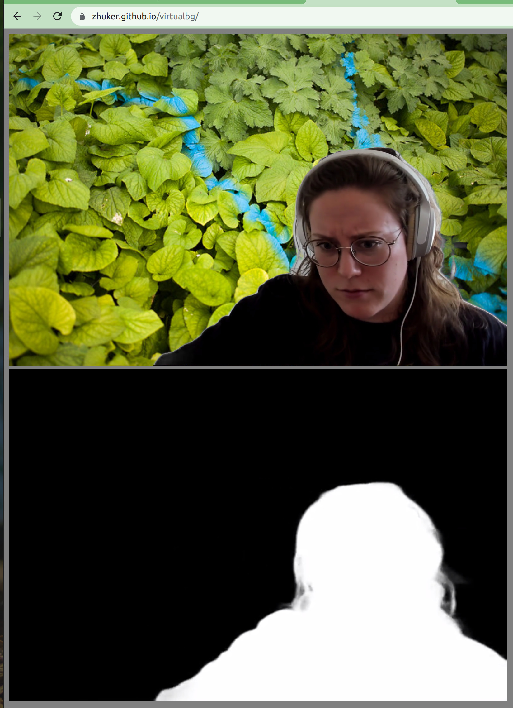

# Replace background in video conference




# Build

```
# wget 'https://storage.googleapis.com/zhukervideo/headroom/megan_nobf_24fps.mp4'
# wget 'https://storage.googleapis.com/zhukervideo/headroom/alpha800_84.mp4'
# pip3 install aiortc aiohttp
# npm install
# npx parcel build index.html 
```

# Run

```
# python3 server.py --play-mask alpha800_84.mp4 --play-face megan_nobf_24fps.mp4
```

Open [http://localhost:8080/index.html](http://localhost:8080/index.html)